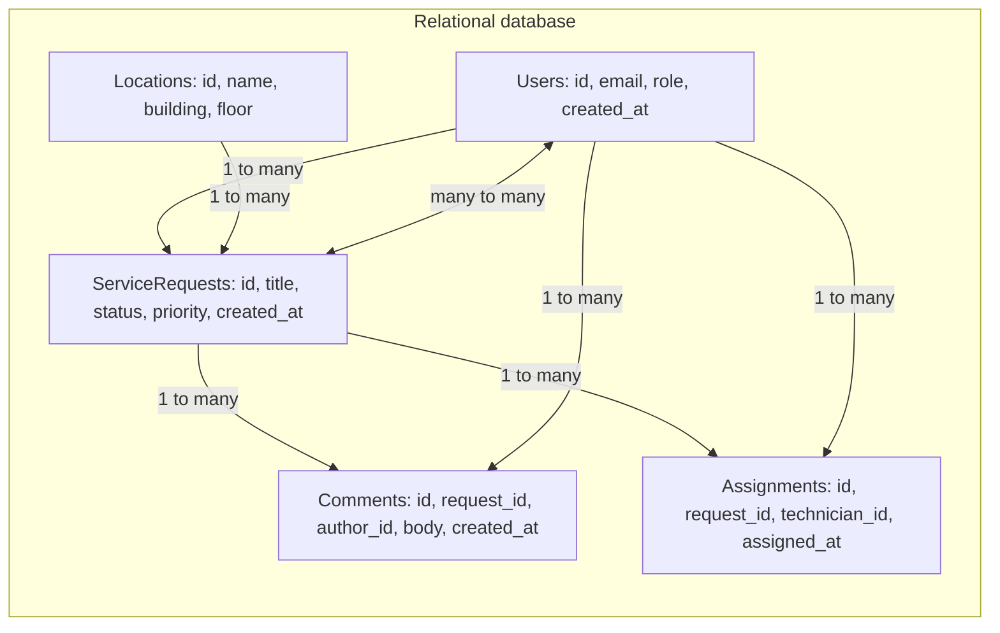

# 4. Data model & storage

## 4.2 Project data schema (mvp)

---

### Notes

* all MVP data is in one boundary: so a single **relational (sql) database**.
* **1..n** relationships use single-ended arrows
* **n..n** is shown as a double ended arrow between
