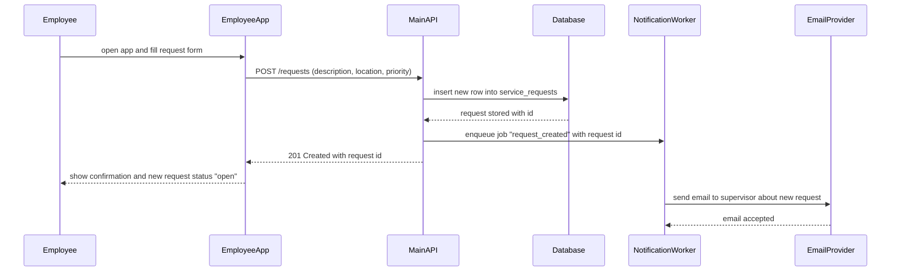
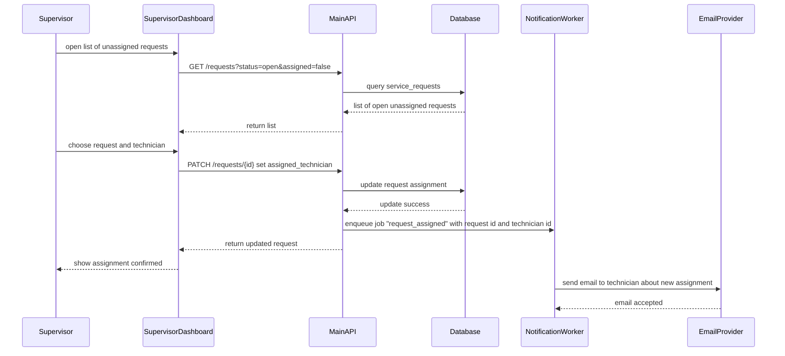
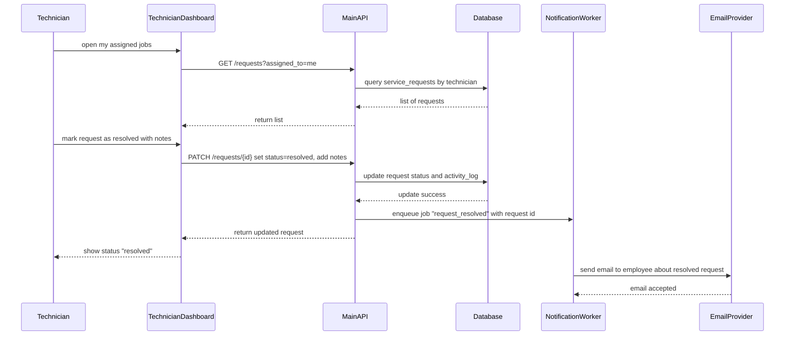
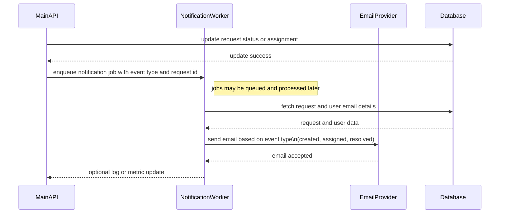

#	Project user flows

### What are the core user flows for my system?
What are the core user flows for your system? This could include a user action, an API request, etc. List 6-10, along with what elements they involve.
| # | Flow                                                                     | Elements involved                                                                        | Unique?                              |
| - | - | - | - |
| 1 | Employee creates a new maintenance request                               | Employee app, Main API, Relational Database, Notification worker, Email provider         | yes, maintenance request workflow               |
| 2 | Employee checks status of an existing request                            | Employee app, Main API, Relational Database                                              | yes,  ties into request lifecycle                |
| 3 | Supervisor reviews unassigned requests and assigns a technician          | Supervisor dashboard, Main API, Relational Database, Notification worker, Email provider |  yes, assignment flow is domain-specific         |
| 4 | Technician views their assigned jobs for the day                         | Technician dashboard, Main API, Relational Database                                      | yes, technician-centric view of data            |
| 5 | Technician updates a request to “in progress” or “resolved” (with notes) | Technician dashboard, Main API, Relational Database, Notification worker, Email provider | yes, state change plus notifications            |
| 6 | System sends notification when a request is created or status changes    | Main API, Notification worker, Email provider, Employee app (receives info next load)    | yes, async notification pattern around requests |
| 7 | User signs in and gets a session/token                                   | Any frontend, Main API, Relational Database (users)                                      | ..mostly generic authN/authZ                       |
| 8 | Supervisor views a simple report of open vs resolved requests            | Supervisor dashboard, Main API, Relational Database                                      | yes, reporting on maintenance workload          |

---
## Sequence diagrams for each
Choose 4 of these unique flows and create a sequence diagram for each, including all the elements of your system that request or data flow will visit, even if some of those elements are contained in the same process.

### 1. employee creates a new maintenance request

### 2. supervisor assigns a technician

### 3. technician resolves a request

### 4. async notification flow on status change

(this is the “pure system” flow, no direct user at the start – useful to show the async worker pattern)

