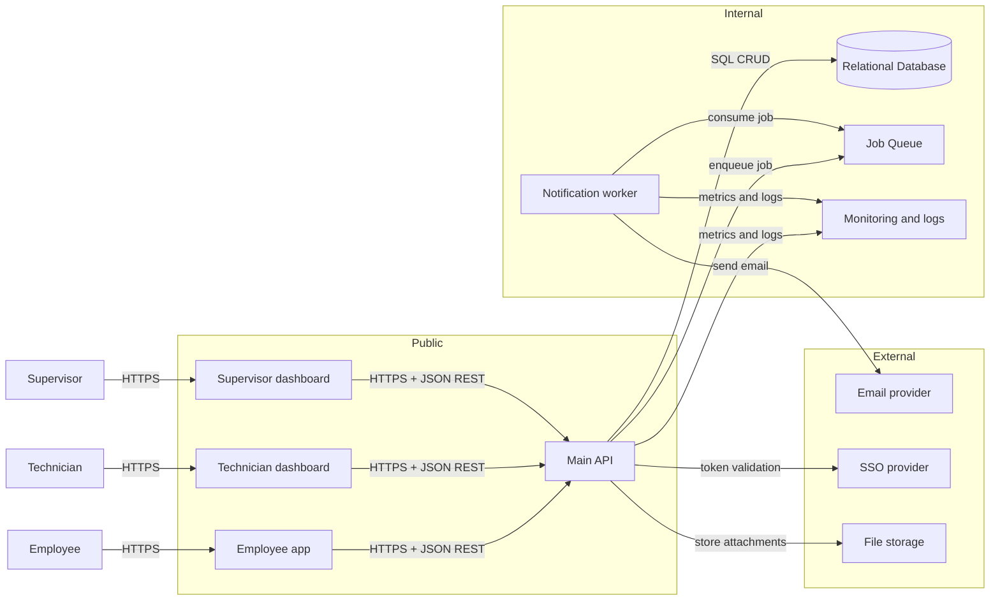

# Project phases

## Phase I

### What gets added in phase I (beyond mvp)

these are the “we can ship this to real people” additions:

* **sso provider (optional but realistic for a company)**

  * employees log in using company identity (less password handling for us)

* **job queue between main api and notification worker**

  * makes async work more reliable (retries, no lost emails)

* **file storage for attachments**

  * employees can attach photos (broken door, leak, etc.)

* **monitoring and logs**

  * basic operational visibility (errors, latency, worker failures)

---

### Phase I architecture diagram (strongly resembles MVP)

---

## Phase II (next improvements after release)

### What i’d add/change in phase ii (specific)

* **real-time updates for request status** (sse or polling upgrade)

  * technician marks “in progress” and the employee sees it quickly (less refresh spam)

* **basic sla + reporting**

  * “average time to assign”, “time to resolve”, “open by location”

* **role + permission management ui**

  * supervisors can add/remove technician access (less manual admin)

* **soft delete + data retention rules**

  * basic compliance hygiene (especially if attachments exist)

---

### How i’d decide implementation order (simple)

1. **reliability first** (queue, retries, monitoring)
2. **high-frequency workflows** (status updates, assignments)
3. **ops visibility** (reporting + sla)
4. **admin + governance** (permissions, retention)

**signals i’d watch**

* lots of “did you get my update?” messages → prioritize real-time updates
* growing backlog / slow resolution → prioritize sla + reporting
* frequent access problems (wrong role, wrong visibility) → prioritize permission management

---

## Future phases (later ideas)

* **mobile app** for technicians (if they’re mostly on-site, phones are better than laptops)
* **asset inventory integration** (link requests to specific equipment, parts, serial numbers)
* **parts tracking** (if “waiting for part” becomes common)
* **on-call + escalation rules** (if urgent tickets are getting missed)
* **multiple sites / multi-tenant setup** (if this expands across many facilities)
* **audit log viewer** (if managers want “who changed what and when”)
* **advanced search** (if the number of requests grows large)
